# Bloch Sphere and Phase: Slides

*Module 2 slide deck, converted from PowerPoint.* Each slide is shown as an image; the text beneath it is extracted from the slide for search and reference.

Source deck: `M2_Bloch_Sphere_and_Phase.pptx`

---

## Slide 1: Bloch Sphere and Phase

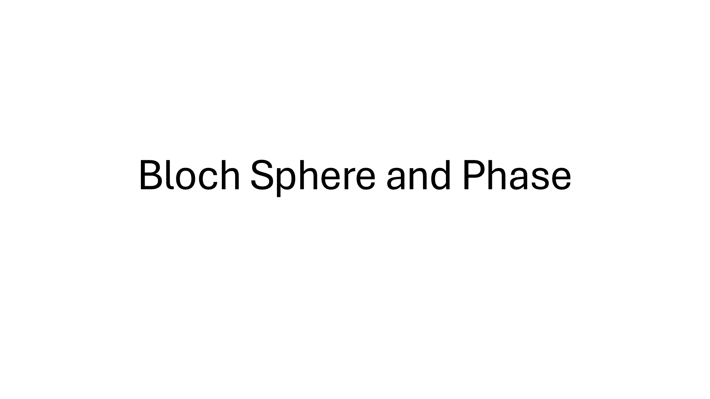

---

## Slide 2: What is Phase?

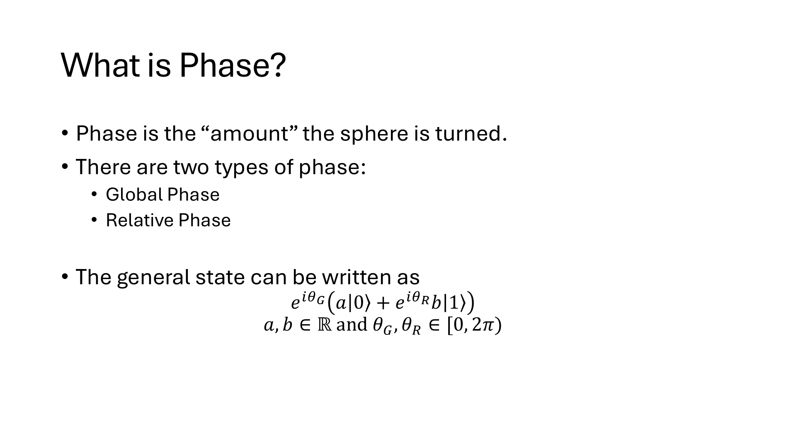

---

## Slide 3: Global Phase

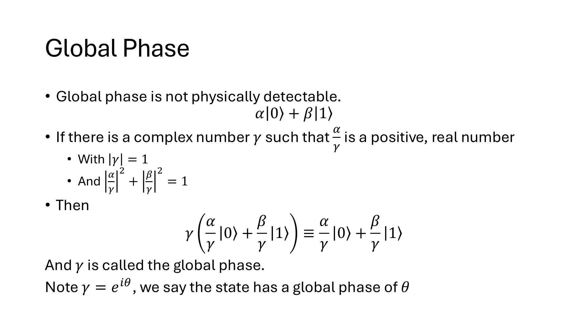

---

## Slide 4: Examples of global phase

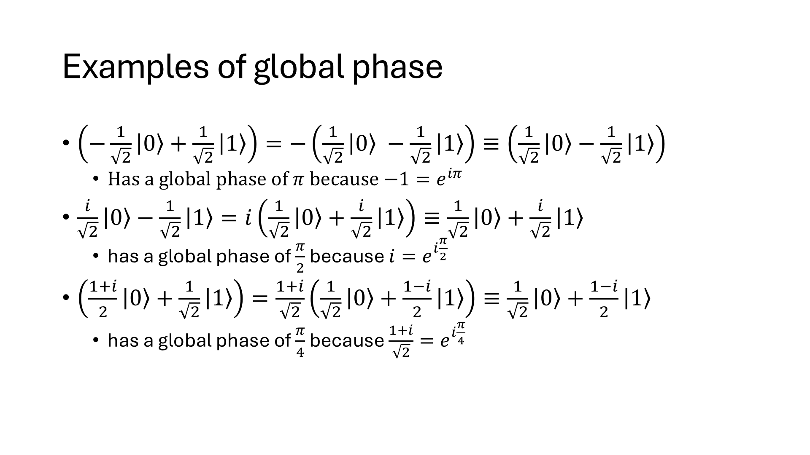

---

## Slide 5: Relative phase

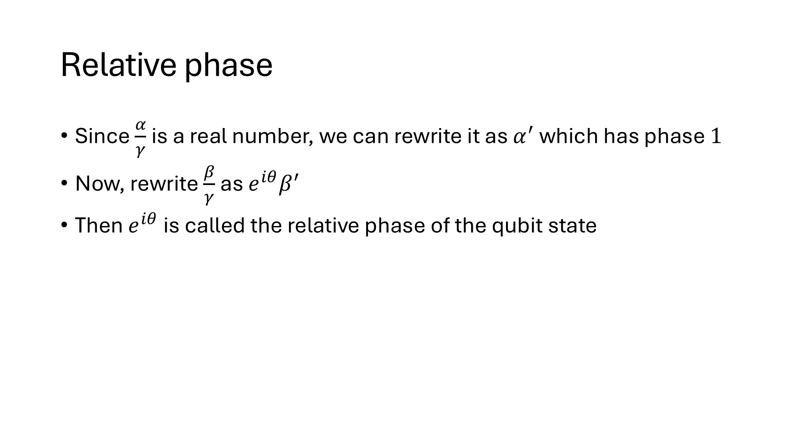

---

## Slide 6: Examples of Relative Phase

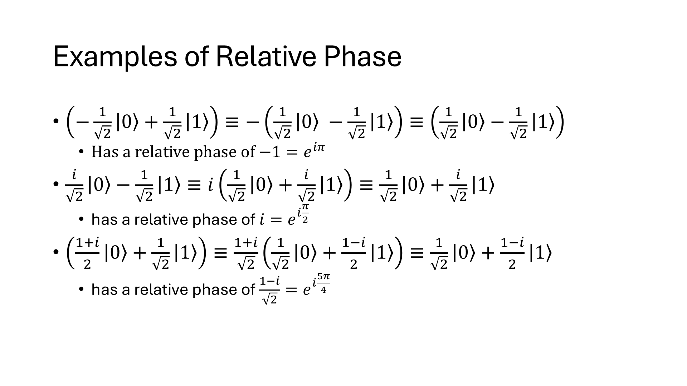

---

## Slide 7: Facts about the phases

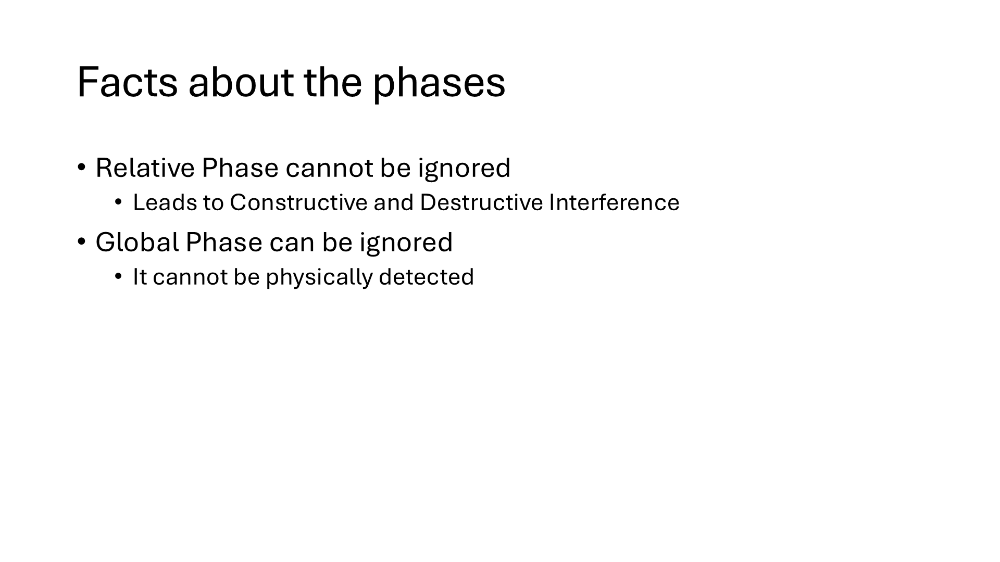

> Relative Phase cannot be ignored
> Leads to Constructive and Destructive Interference
> Global Phase can be ignored
> It cannot be physically detected

---

## Slide 8: Interference (from relative phase)

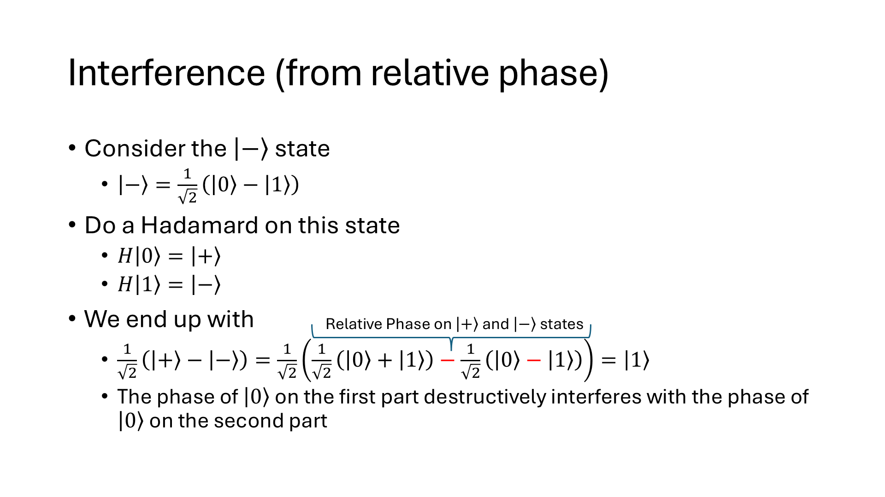

---

## Slide 9: Bloch Sphere

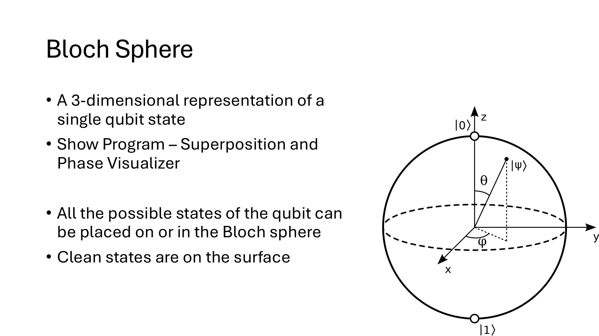

> A 3-dimensional representation of a single qubit state
> Show Program – Superposition and Phase Visualizer
> All the possible states of the qubit can be placed on or in the Bloch sphere
> Clean states are on the surface

---

## Slide 10: Gates Visualization on Bloch Sphere

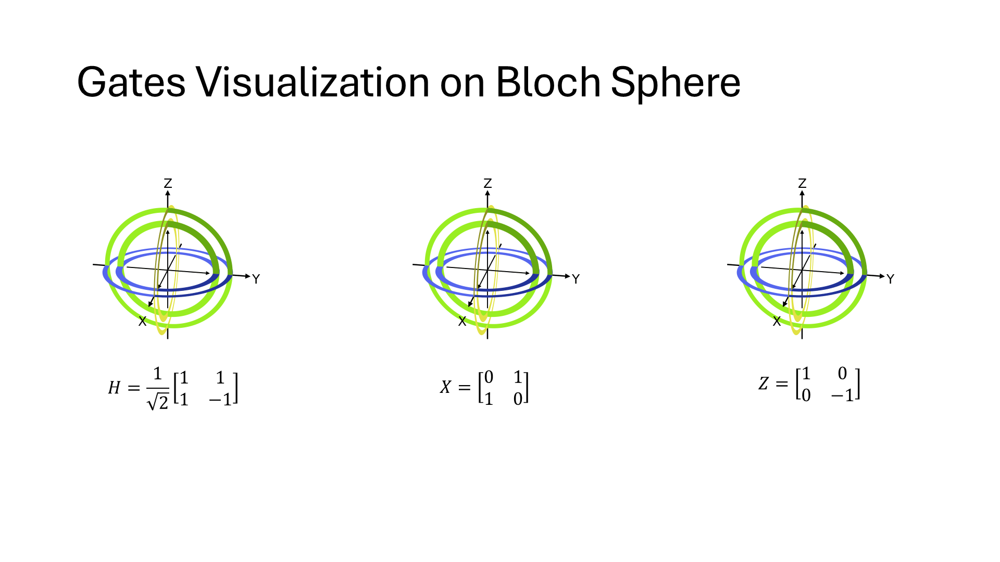

---

## Slide 11: Y-Gate Visualization

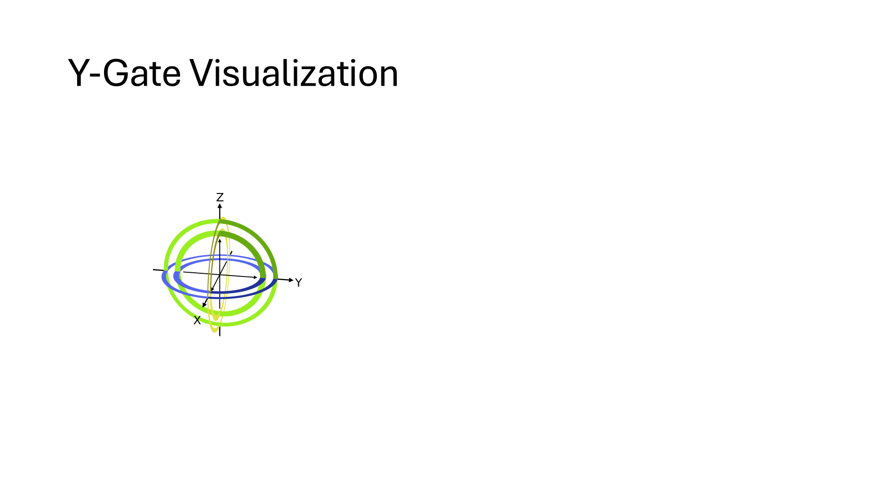

---

## Slide 12: Phase Kick-back

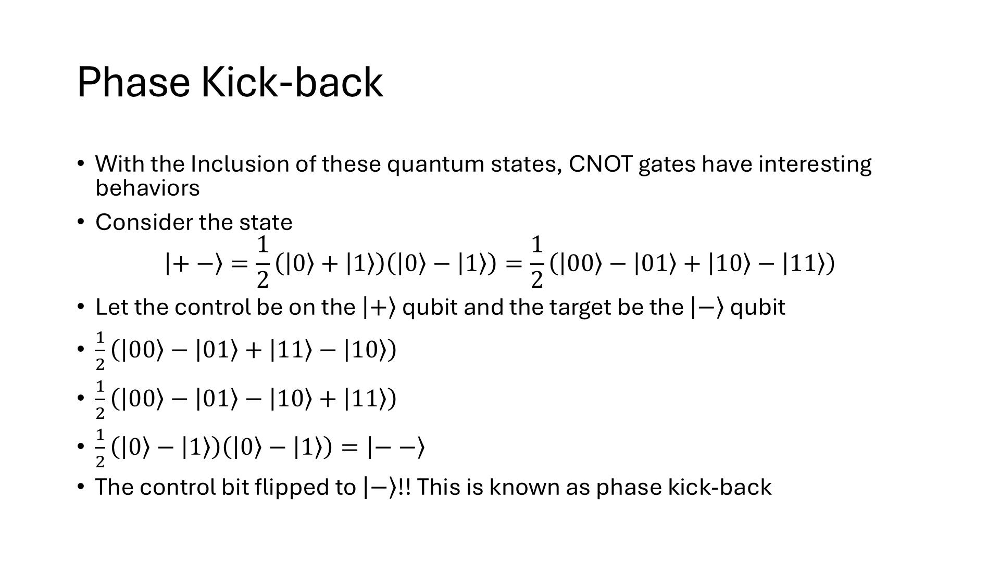

---

## Slide 13: Questions

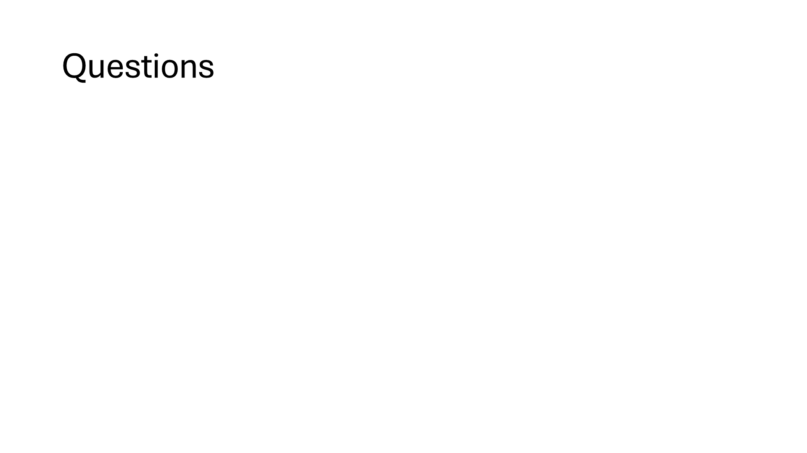

---
