# Quantum Information: Slides

*Module 2 slide deck, converted from PowerPoint.* Each slide is shown as an image; the text beneath it is extracted from the slide for search and reference.

Source deck: `M2_Quantum_Information.pptx`

---

## Slide 1: Quantum Information

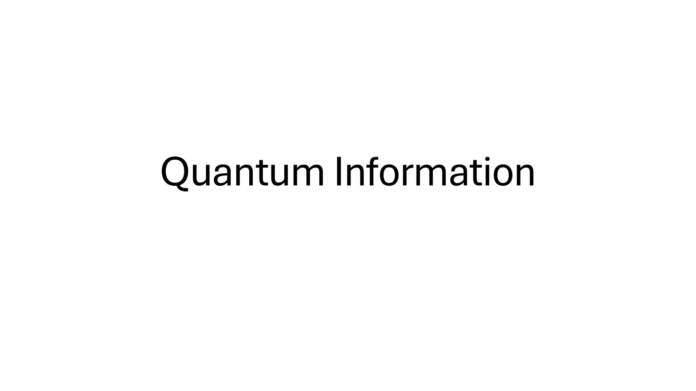

---

## Slide 2: Low-level Classical Computing

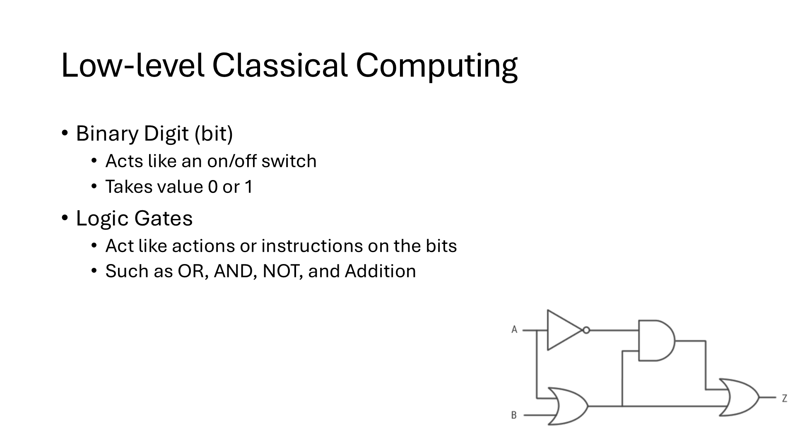

> Binary Digit (bit)
> Acts like an on/off switch
> Takes value 0 or 1
> Logic Gates
> Act like actions or instructions on the bits
> Such as OR, AND, NOT, and Addition

---

## Slide 3: Quantum Gates

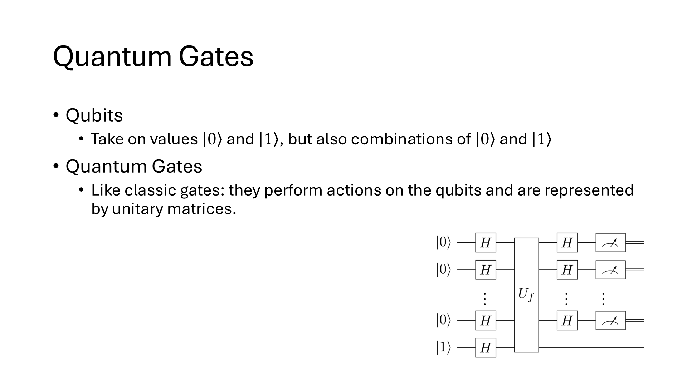

---

## Slide 4: Classic Gates

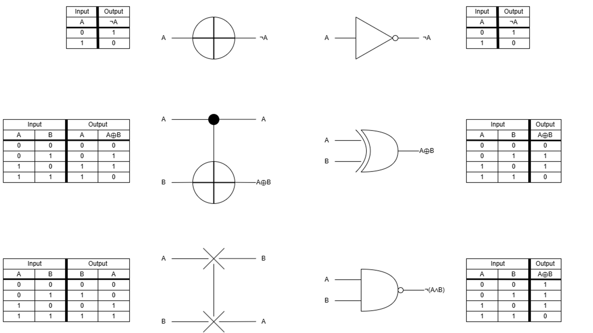

---

## Slide 5: Some Important Qubit States

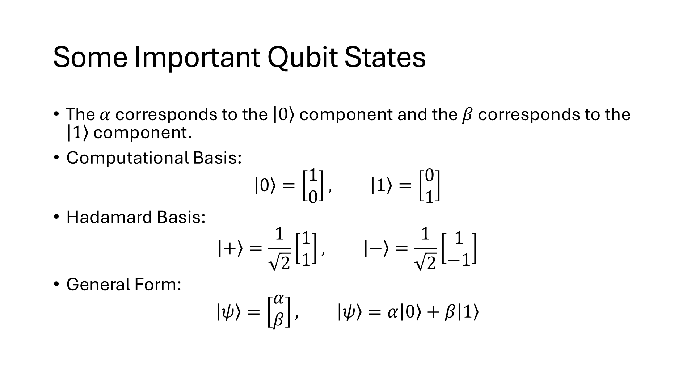

---

## Slide 6: Some Important Quantum Gates

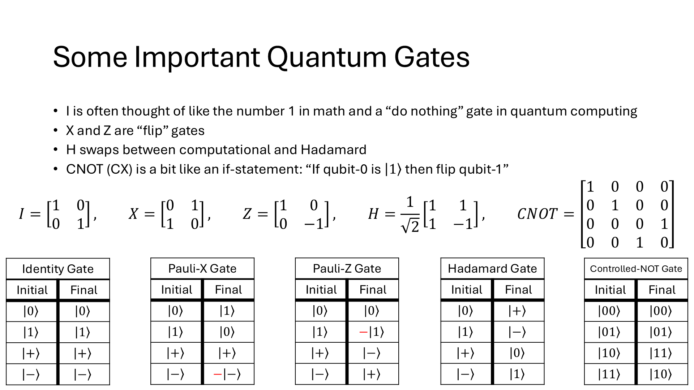

---

## Slide 7: Translating circuits to math

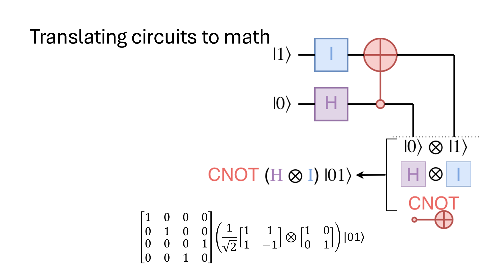

---

## Slide 8: Vector Tensor Product

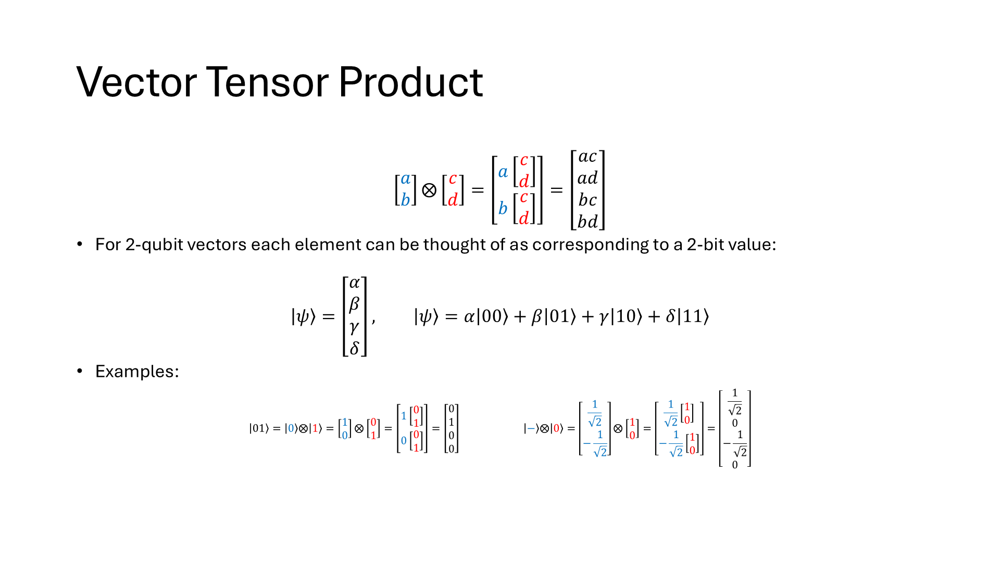

---

## Slide 9: Tensor Product

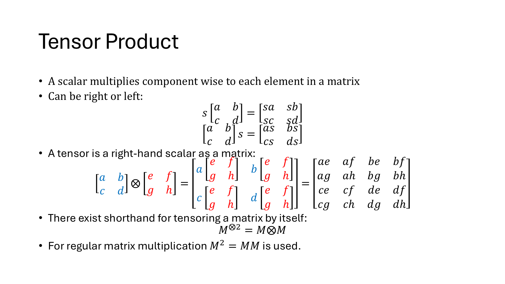

---

## Slide 10

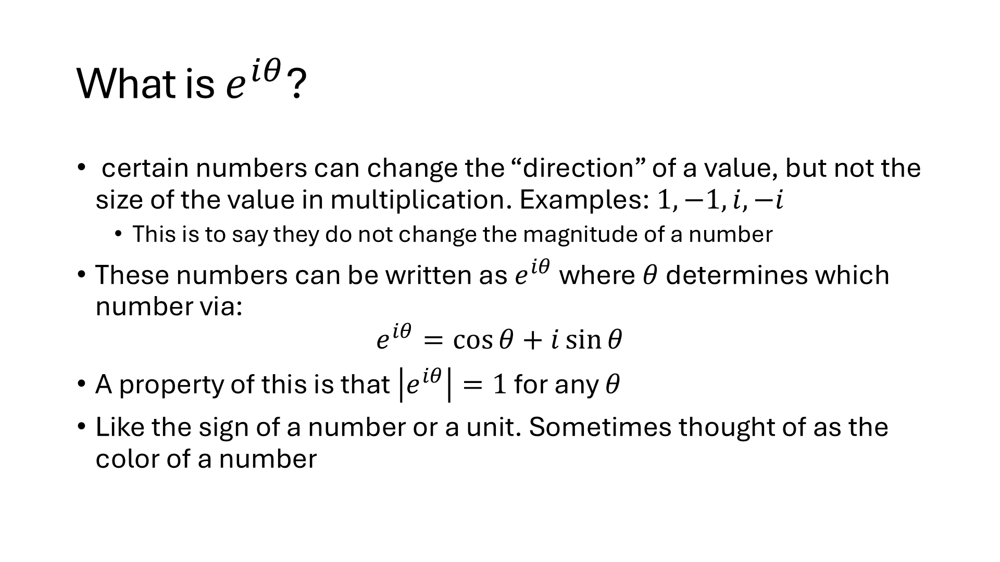

---

## Slide 11: Global Phase

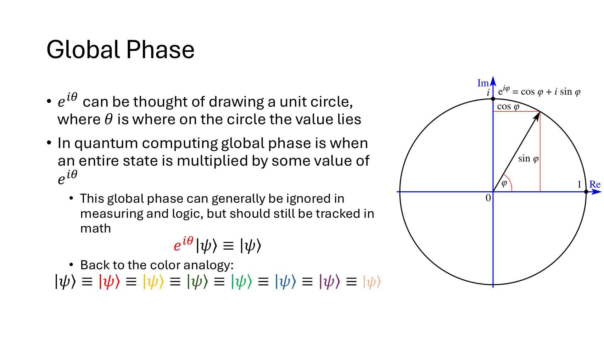

---

## Slide 12: Unitary Properties

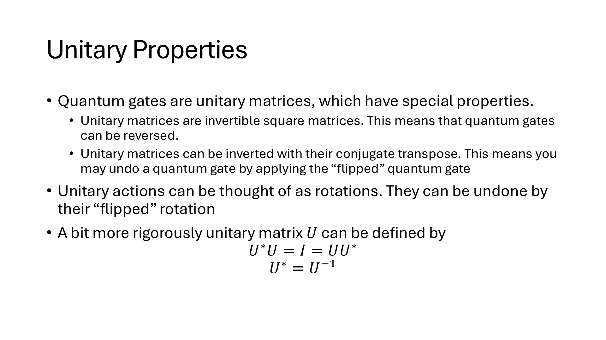

---

## Slide 13: Conjugate Transpose

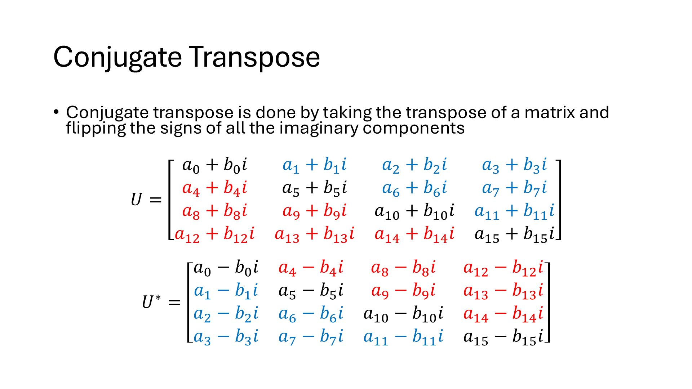

---
