# Measurement and Entanglement: Slides

*Module 3 slide deck, converted from PowerPoint.* Each slide is shown as an image; the text beneath it is extracted from the slide for search and reference.

Source deck: `M3_Measurement_and_Entanglement.pptx`

---

## Slide 1: Measurement and Entanglement

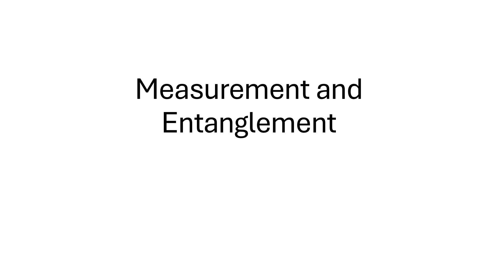

---

## Slide 2: Topics

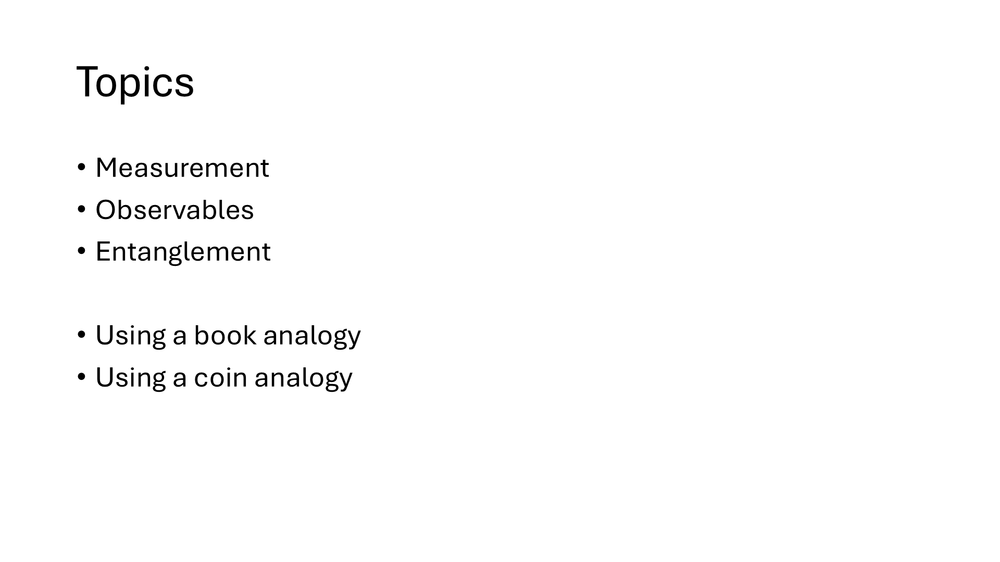

> Measurement
> Observables
> Entanglement
> Using a book analogy
> Using a coin analogy

---

## Slide 3: Measurement

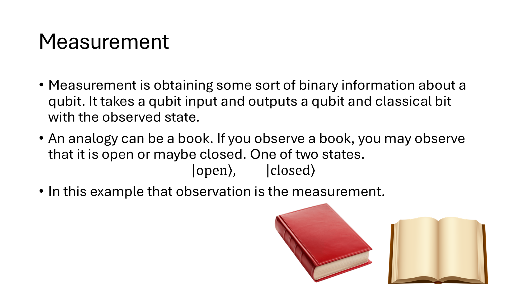

---

## Slide 4: Measurement Coin

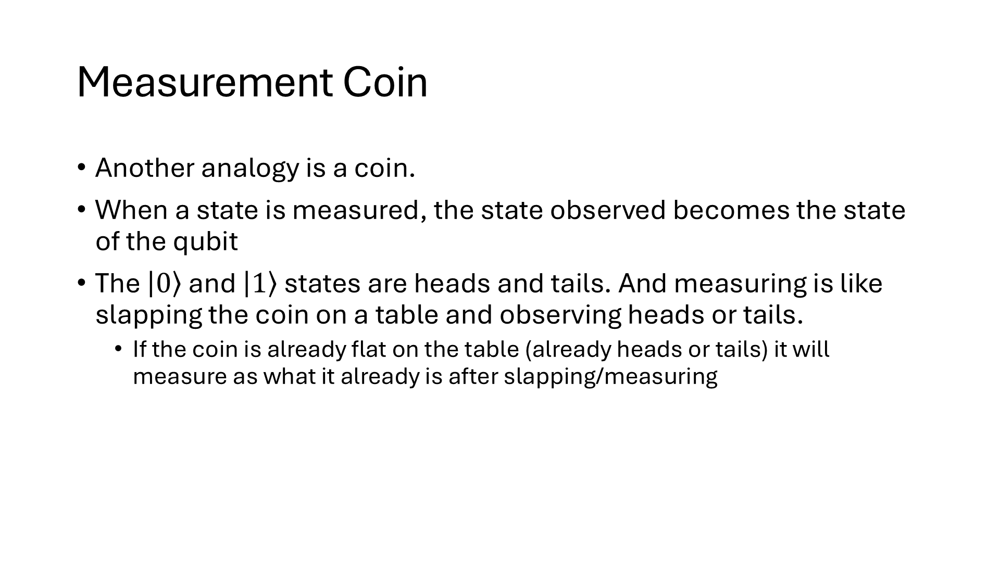

---

## Slide 5: Measuring after a circuit

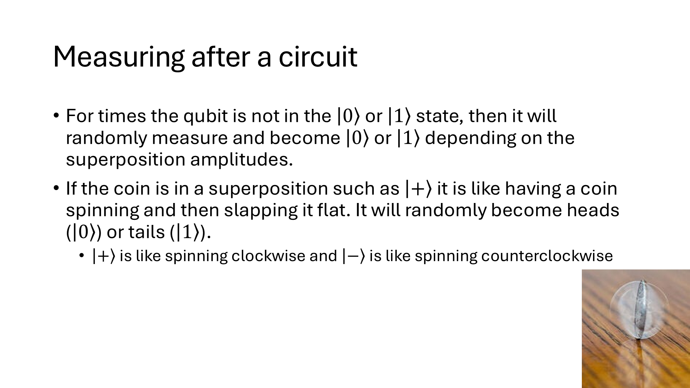

---

## Slide 6: Measurement Fundamentally Changes the State

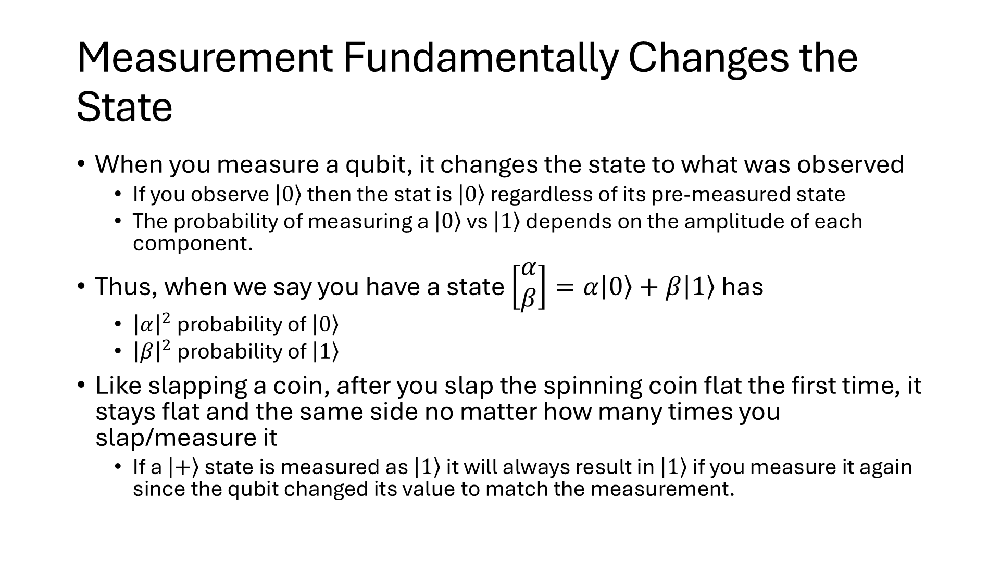

---

## Slide 7: Observable

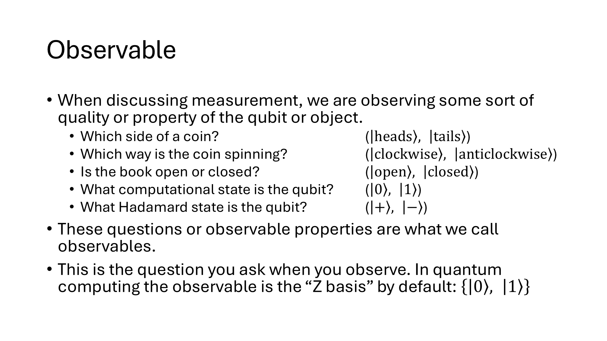

---

## Slide 8: What are those “Observable Strings” in Qiskit

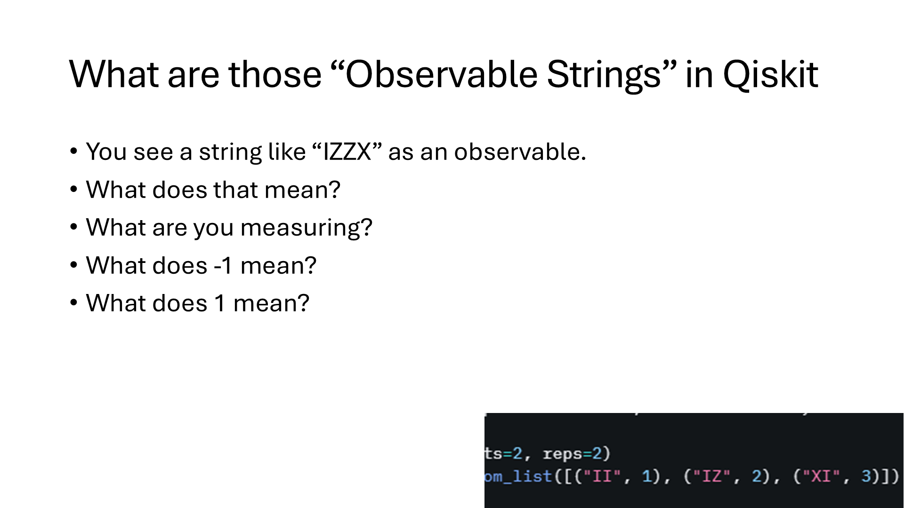

> You see a string like “IZZX” as an observable.
> What does that mean?
> What are you measuring?
> What does -1 mean?
> What does 1 mean?

---

## Slide 9: First let’s look at one qubit

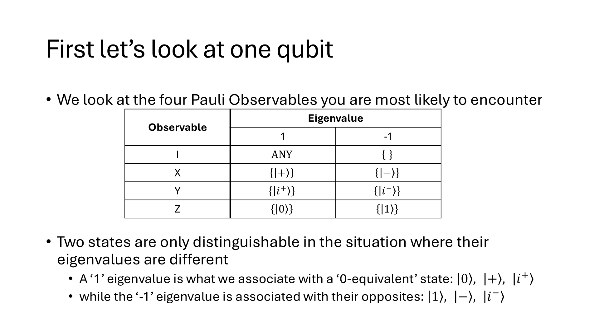

---

## Slide 10: What about two qubits?

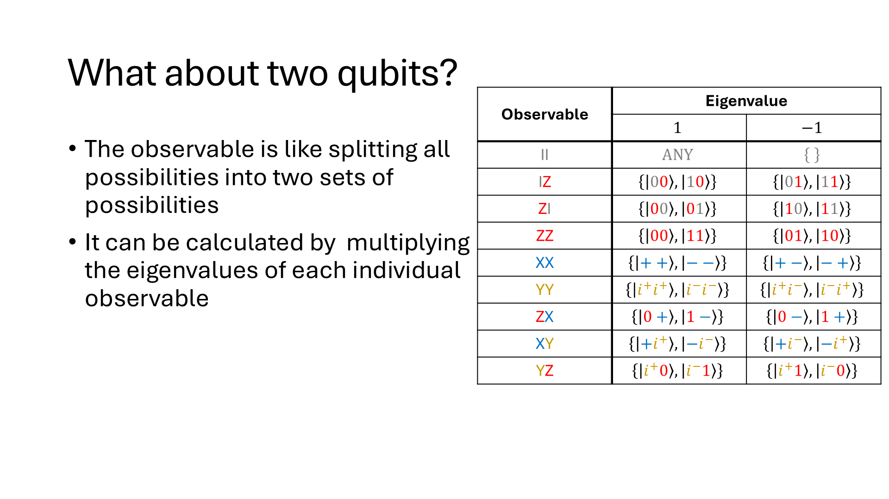

> The observable is like splitting all possibilities into two sets of possibilities
> It can be calculated by  multiplying the eigenvalues of each individual observable

---

## Slide 11: Calculating Observable Value by String

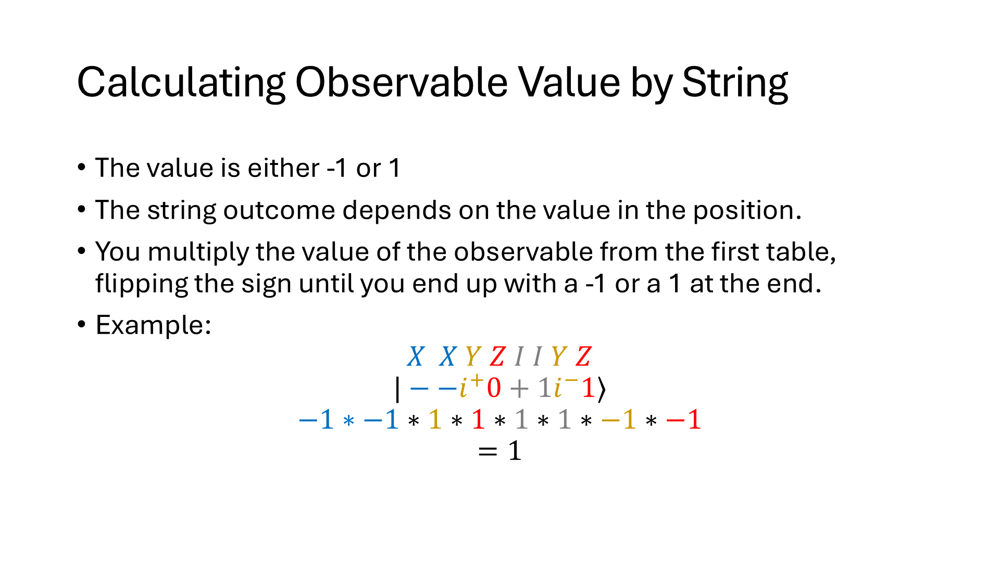

---

## Slide 12: What does entanglement look like?

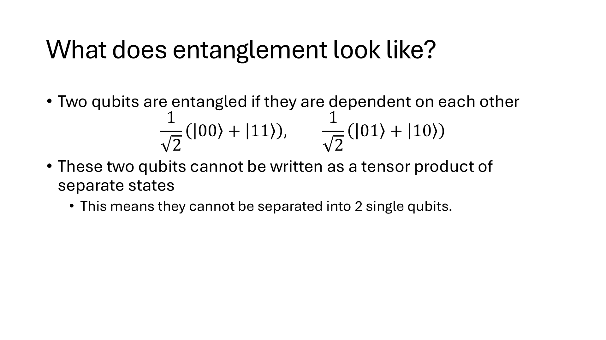

---

## Slide 13: Entanglement comes from Superposition

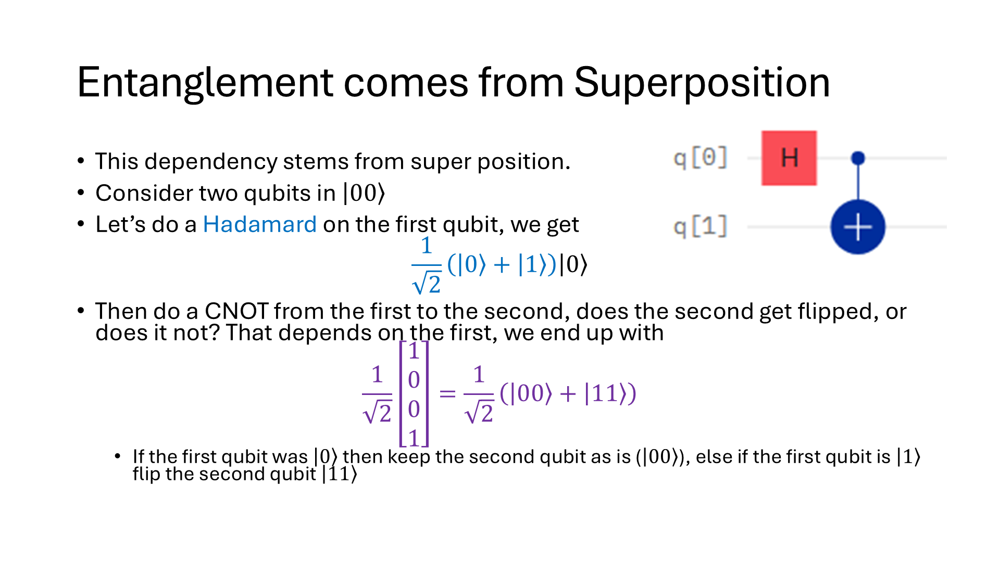

---
