# Grover’s Algorithm: Slides

*Module 5 slide deck, converted from PowerPoint.* Each slide is shown as an image; the text beneath it is extracted from the slide for search and reference.

Source deck: `M5_Grovers_Algorithm.pptx`

---

## Slide 1: Grover’s Algorithm

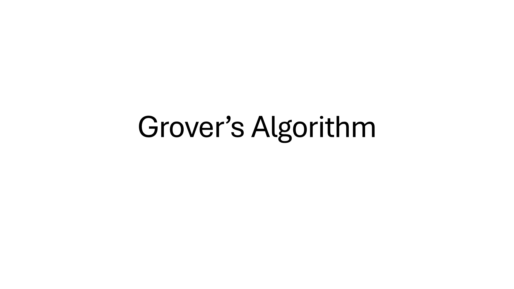

---

## Slide 2: Classical Database Search

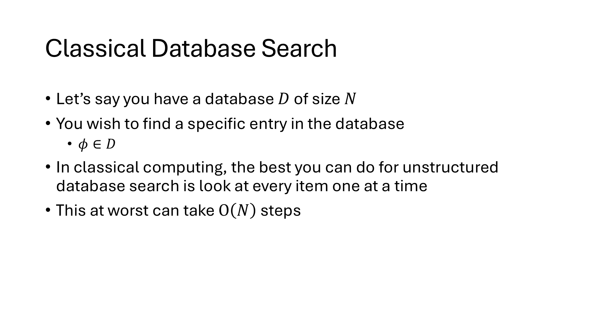

---

## Slide 3: Grover’s Algorithm

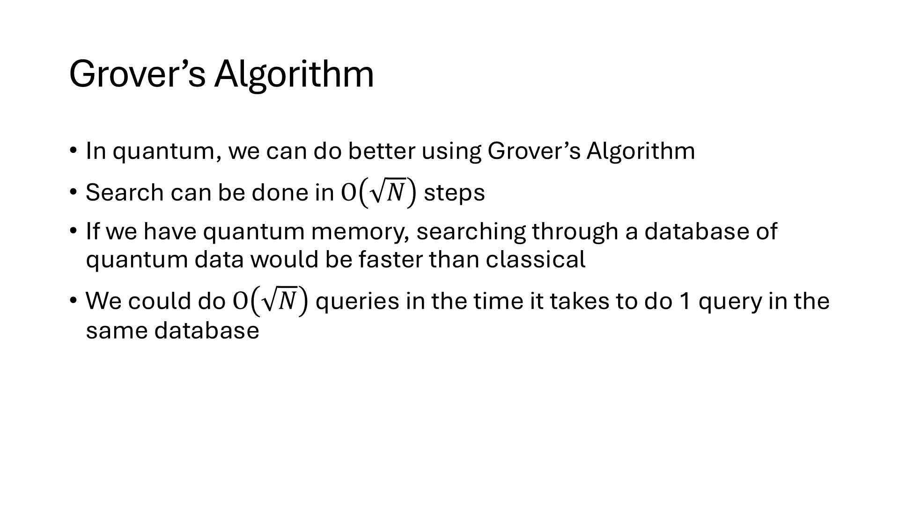

---

## Slide 4: Caveats

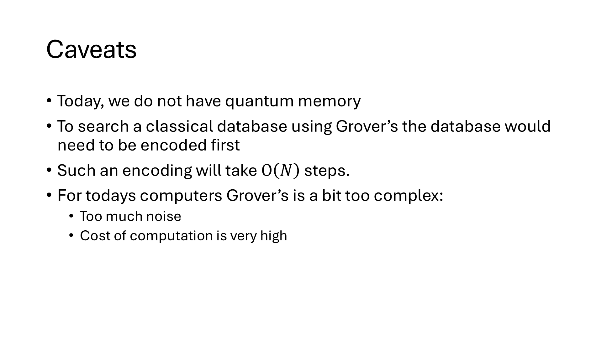

---

## Slide 5: So why Grover’s now?

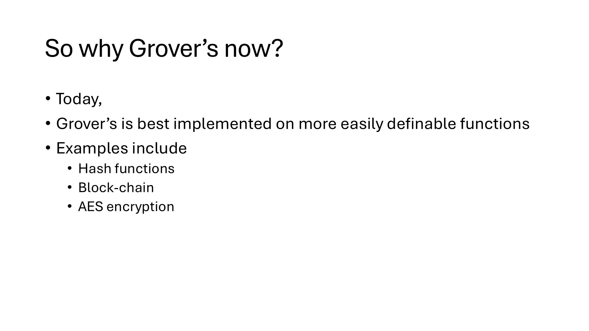

> Today,
> Grover’s is best implemented on more easily definable functions
> Examples include
> Hash functions
> Block-chain
> AES encryption

---

## Slide 6: Part 1: the Oracle

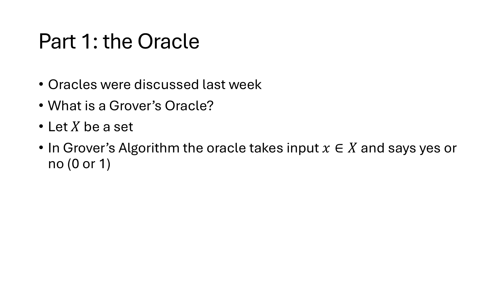

---

## Slide 7: Oracle marked_states

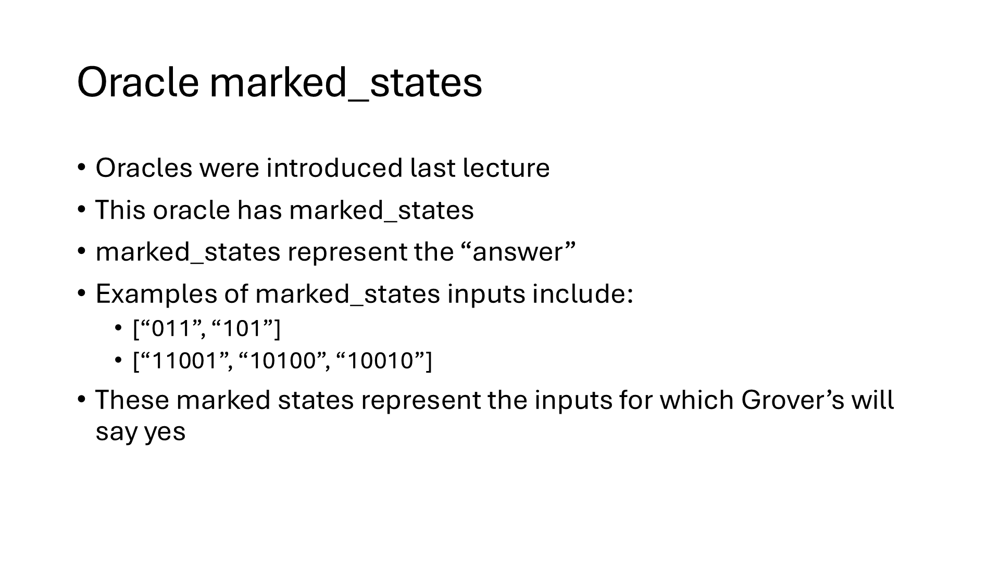

> Oracles were introduced last lecture
> This oracle has marked_states
> marked_states represent the “answer”
> Examples of marked_states inputs include:
> [“011”, “101”]
> [“11001”, “10100”, “10010”]
> These marked states represent the inputs for which Grover’s will say yes

---

## Slide 8: Oracle Unitary Definition

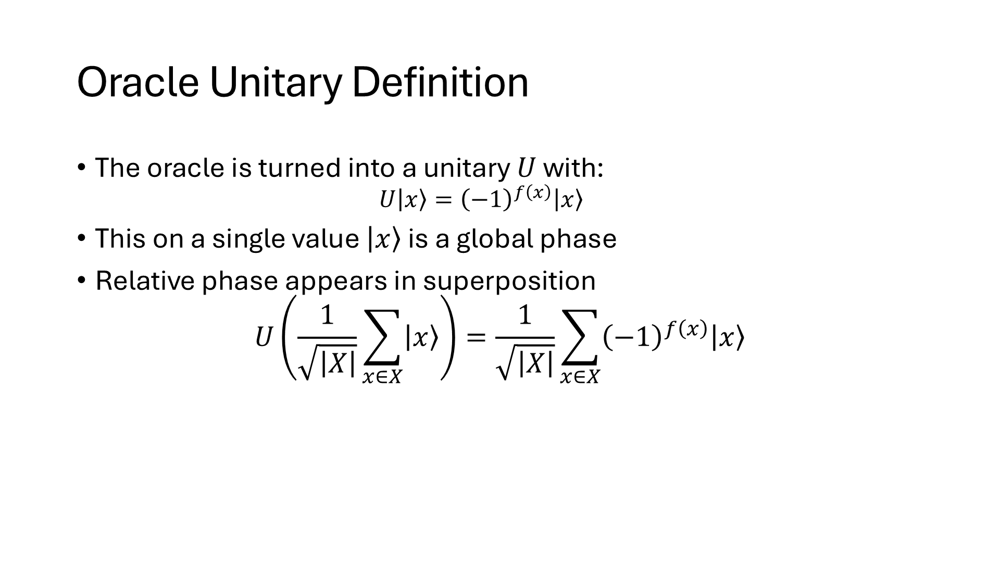

---

## Slide 9: Part 2: Grover’s Technique

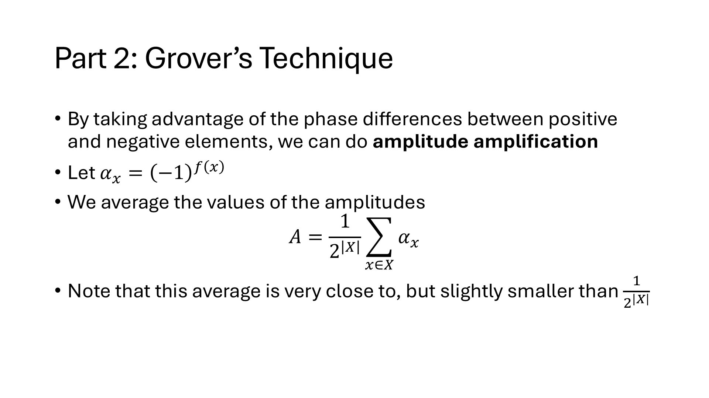

---

## Slide 10: Amplitude Amplification

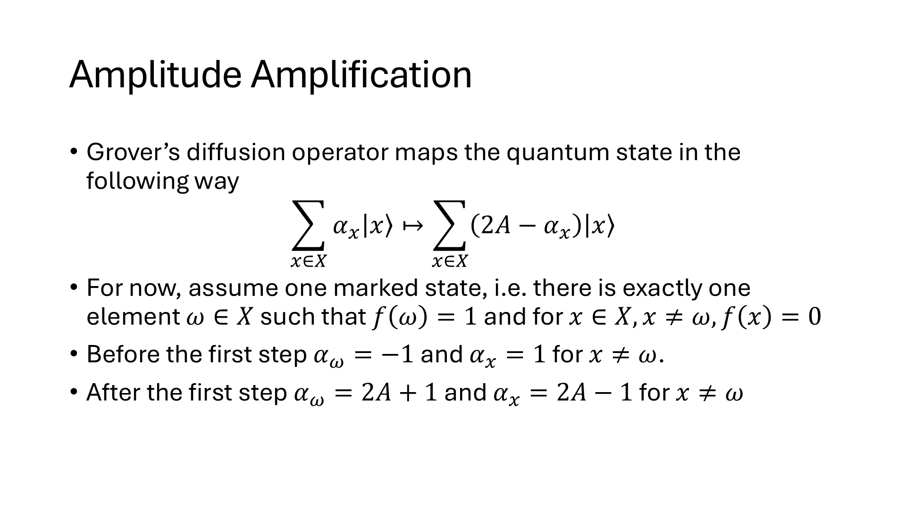

---

## Slide 11: Grover Operator

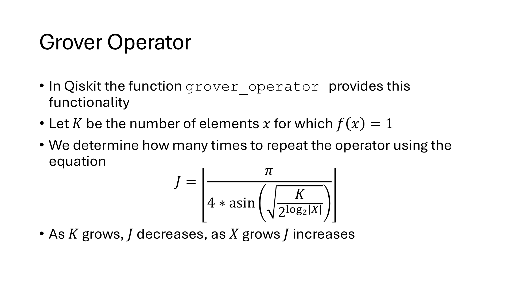

---

## Slide 12: Homework: IBM Grover’s Exercise

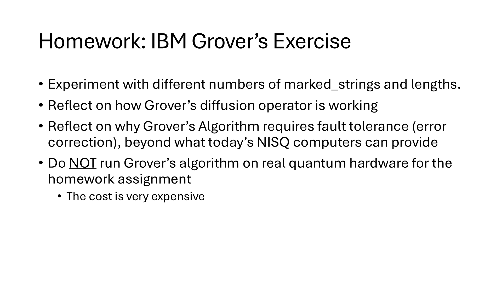

> Experiment with different numbers of marked_strings and lengths.
> Reflect on how Grover’s diffusion operator is working
> Reflect on why Grover’s Algorithm requires fault tolerance (error correction), beyond what today’s NISQ computers can provide
> Do NOT run Grover’s algorithm on real quantum hardware for the homework assignment
> The cost is very expensive

---
